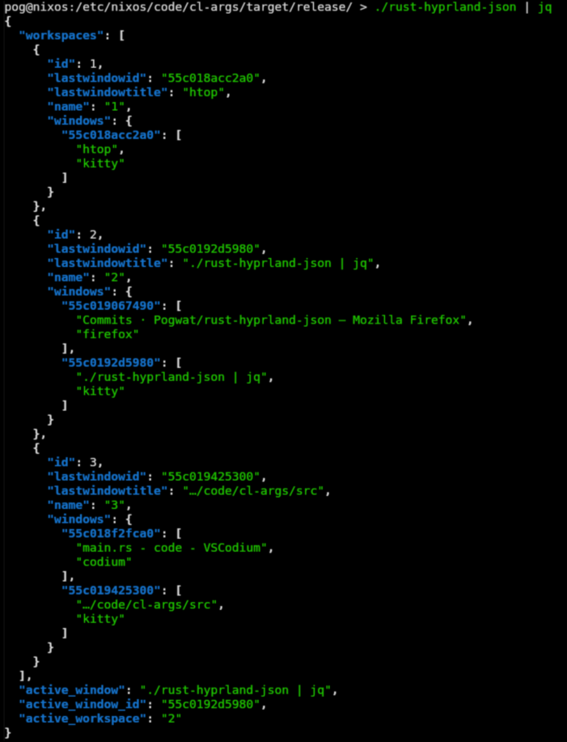

# rust-hyprland-json
A hyprland event json serializer, currently no multi-monitor support. 
Most serilization is done manual with println! fromating, and a little deserilization with serde. It is designed to be used with a json parsers like jaq or jq and jaq in eww. 

## Features
* Workspace id's and names and their windows data
* active window name and id
* active workspace
* All in serialized json
* Specifcy IPC socket path with --path or -p




## Installation
Currently NOT packaged `:( `

### Binary Release
Just download the pre-compiled binary under releases

### Cargo Compilation
To compile with Cargo you need git (or some tool to fetch files from this repo) and cargo installed

Clone the repo 
```bash
git clone https://github.com/Pogwat/rust-hyprland-json
```

Move into cloned repo folder 
```bash
cd rust-hyprland-json
```

Compile the code in src 
```bash
cargo build --release
```

The binary should be stored in:  
./target/release/rust-hyprland-json

### Using Nix (my preferd way)
You obviously need to have nix installed
This for for Nixos specifically but can be adapted for nix:

Save this to a file.nix 
replace file.nix with a name
```nix
{ rustPlatform, lib, fetchFromGitHub }:
rustPlatform.buildRustPackage rec {
  pname = "rust-hyprland-json";
  version = "0.3.5";
  src =  fetchFromGitHub {
    owner = "Pogwat";
    repo = "rust-hyprland-json";
    rev = "v${version}";
    hash = "sha256-h2inMSAMERNKyWpPPHF925v/bcQ3a6T2JWSG5NGWqFc=";
  };
  cargoLock = {
    lockFile = "${src}/Cargo.lock";
  };

  meta = {
    description = "Read hyprland events from hyprlands socket and output them into serlieaized json ";
    homepage = "https://github.com/Pogwat/rust-hyprland-json/";
    license = lib.licenses.gpl3Only;
    platforms = lib.platforms.linux;
    maintainers = with lib.maintainers; [];
    mainProgram = "rust-hyprland-json";
  };
}


```

Add this to configuration.nix
Repalce /path/to/file.nix.nix with the actual path of the above file
```nix

nixpkgs.overlays = [

(final: prev: {
  rust-hyprland-json = final.callPackage /path/to/file.nix.nix {};
}) 


];

environment.systemPackages = [rust-hyprland-json];
```


## Usage
~~Currnetly NO command line arguments.~~Now with command line arguments.
-p,--path for custom IPC path
-h, --help for help
-v, --version for version


 run rust-hyprland-json and pass it to a json parser

### Eww
My personal eww config uses it for the status bar
Heres a snippet:
```yuck
(deflisten all
'rust-hyprland-json')

(defwidget window []
  (box  :orientation "h" :space-evenly true :halign "end"
    (label  :text  '${all.active_window}' )
    ))

(defwidget sidestuff []
  (box  :orientation "h" :spacing 20 :space-evenly false  :halign "end"
    (label  :text "${round(EWW_RAM.used_mem/(powi(1024, 2)),0)}MB" )
    (label  :text  time )
    (label  :text date )
   ; (label  :text   {EWW_BATTERY.BAT0.status} )
    (label  :text   "${round(EWW_CPU.avg, 2)}%" )
    (label  :text "${bluetooth_name}: ${bluetooth_battery}% ")

)
  )


(defwidget workspaces[]
(box
       :orientation "h"
       :space-evenly true
       :halign "start"

 (for workspace in {all.workspaces}
  (button 
  :onclick `hyprctl dispatch workspace "${workspace.name}"`
  :class {workspace.id == all.current_workspace ? 'active' : ''}
 
   `${workspace.name}`))))

   (defwidget bar []
  (centerbox :orientation "h"
    (workspaces)
    (window)
    (sidestuff)))
```